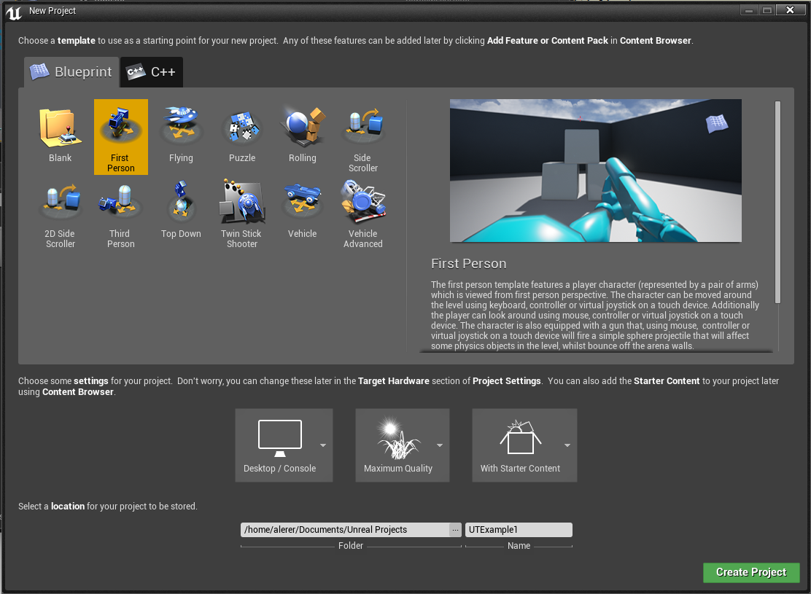
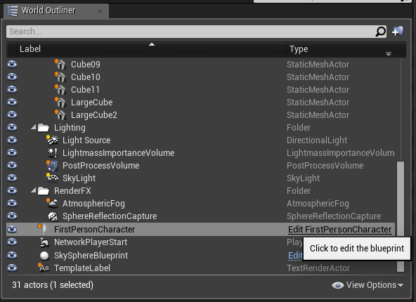
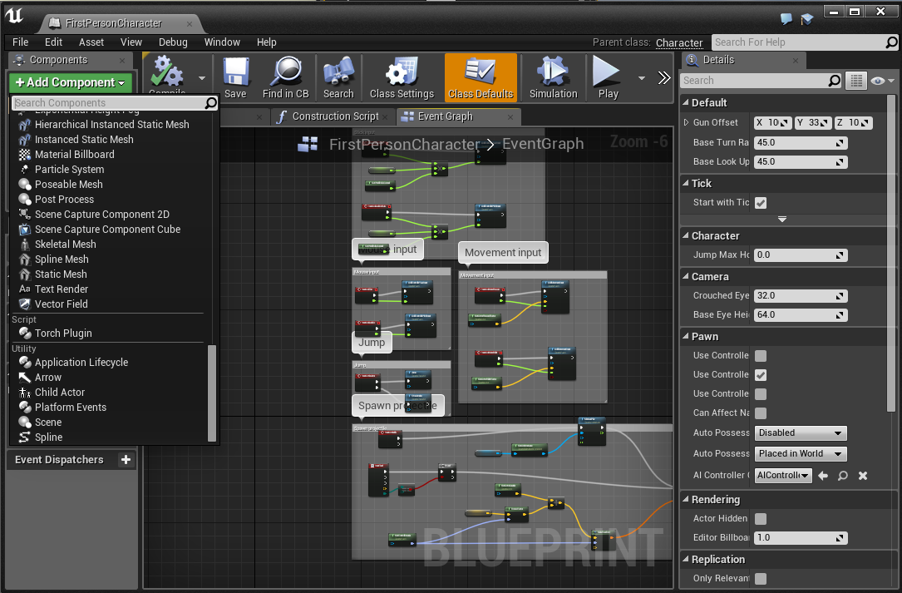
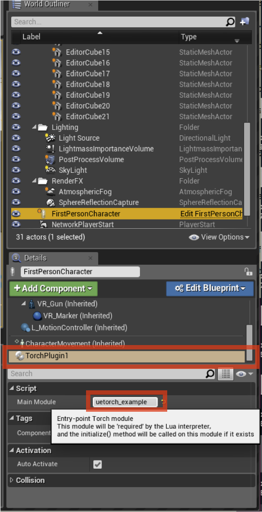
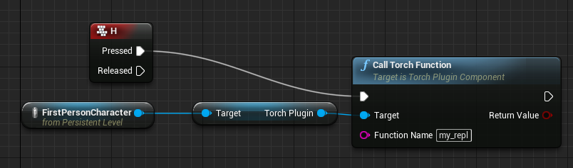

# UnrealTorch
UnrealTorch is an [Unreal Engine 4](http://www.unrealengine.com) plugin that adds support for embedded Lua/Torch scripts in the game engine loop, and a set of Lua APIs for providing user input, taking screenshots and segmentation masks, controlling game state, running faster than real time, etc.
UnrealTorch strongly leverages the sparsely documented [ScriptPlugin](https://forums.unrealengine.com/showthread.php?3958-Scripting-Language-extensions-via-plugins) plugin provided with Unreal Engine 4.

## Requirements
See the [Unreal Engine 4 Requirements](https://docs.unrealengine.com/latest/INT/GettingStarted/RecommendedSpecifications/).
UnrealTorch was developed for Linux; see [Building Unreal Engine on Linux](https://wiki.unrealengine.com/Building_On_Linux#Prerequisites). Running on Mac and Windows is not currently supported, but should be relatively straightforward if you're willing to figure out the build process.


## Installing UnrealTorch
1. Download and install torch from https://github.com/torch/torch-distro. We would like to use Lua 5.2, so before installing, replace LUAJIT21 with LUA52 in install<span></span>.sh.
2. Set up an Epic Games account at https://github.com/EpicGames/UnrealEngine/, needed to download Unreal Engine.
3. Visit https://wiki.unrealengine.com/Building_On_Linux to learn how to configure your system for running Unreal Engine on Linux.
4. Install UnrealEngine / UnrealTorch
 ```bash
 git clone https://github.com/EpicGames/UnrealEngine.git
 cd UnrealEngine
 
 # clone UnrealTorch into the plugins directory
 git clone https://github.com/facebook/UnrealTorch.git Engine/Plugins/UnrealTorch
 # run the UnrealTorch setup script
 # this will update you to a specific revision on UnrealEngine-4.8, add some patches, and set up the Lua paths
 Engine/Plugins/UnrealTorch/Setup.sh
 
 # grab some coffee, this will take a long time
 ./Setup.sh && ./GenerateProjectFiles.sh && make
 ```
5. Profit!

## Getting Started with UnrealTorch

1. source Engine/Plugins/UnrealTorch/unrealtorch\_activate.sh

2. Launch Unreal Engine 
 ```bash
 cd Engine/Binaries/Linux
 ./UE4Engine
 ```

3. Create a new 'First Person' project. 
 

4. Lets add a TorchPlugin component to the player. In the 'World Outliner' panel, click 'Edit FirstPersonCharacter'.
 

 Inside the window that pops up, click 'Add Component, and select 'Torch Plugin'. This will add a Torch Plugin component to FirstPersonCharacter.
 

5. Now we just need to set the module name for the UnrealTorch script that the component will run. We'll use the example script in UnrealTorch/Scripts/unrealtorch\_example.lua. The unrealtorch\_activate.sh script already added UnrealTorch/Scripts to our path, so if we got back to the World Outliner, we can just set the 'Main Module' field on the TorchPlugin to 'unrealtorch\_example'.
 

6. The interactive Torch REPL won't work inside this editor process because it is a child process with no attached TTY. Go to File->Open Project, check 'Always load last project on startup', and select your project. Then restart UE4Editor, and your project should load.
7. Press the 'Play' button. The game should freeze and you will notice that on the command line you have a torch prompt. That's because the example called `start_repl()` in the initialization function. You can type `break` to exit the REPL. The player will now move towards the cubes, based on the simple tick function inside unrealtorch\_example.lua. Go take a look at that script now.
8. You may want to call a Lua function from inside Unreal Engine's [Blueprints scripting language](https://docs.unrealengine.com/latest/INT/Engine/Blueprints/index.html). Lets see how to do that now. We'll add a routine to the 'level blueprint' that calls into Lua when you press a key. Open the level blueprint (from the Blueprints menu). Right click in the main window to add a new widget, uncheck 'Context Sensitive', and search for 'Call TorchFunction String'. This function takes a (global) Lua function name, and a string input, and returns a string output (your function must have string input/output -- you can add other blueprints function signatures yourself in the C++ code). You can then drag your FirstPersonCharacter into the blueprint and hook up its TorchPlugin component as the target. Read the [Blueprints documentation](https://docs.unrealengine.com/latest/INT/Engine/Blueprints/index.html) for more details. Here's what the final blueprint should look like
 

## Full documentation
To learn how to develop Unreal Engine projects, see the Unreal Engine documentation at https://docs.unrealengine.com/latest/INT/.

In-line documentation for the APIs provided by UnrealTorch can be found in UnrealTorch/Scripts/unrealtorch.lua.

More coming soon.

## Join the UnrealTorch community
See the CONTRIBUTING file for how to help out.

## License
UnrealTorch is BSD-licensed. We also provide an additional patent grant.
